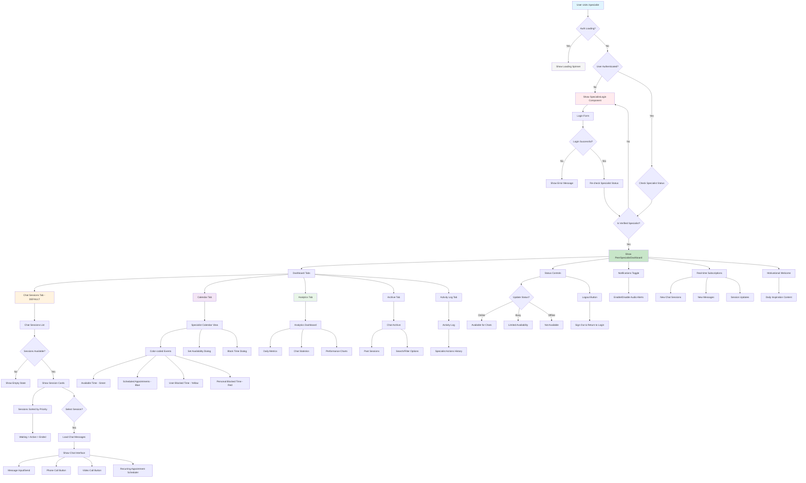

# Specialist Portal User Flow Documentation

## Overview
This document outlines the complete user flow for the `/specialist` route in the LEAP application. The specialist portal provides peer specialists with tools to manage chat sessions, schedule appointments, view analytics, and maintain their availability status.

## Flow Diagram

## Detailed Flow Components

### 1. Authentication Layer
The specialist portal has a multi-layered authentication system:

- **User Authentication**: Checks if user is authenticated via Supabase Auth
- **Specialist Verification**: Validates that the user is a verified peer specialist
- **Active Status Check**: Ensures the specialist account is active and verified

### 2. Dashboard Structure
The main dashboard consists of five primary tabs:

#### **Chat Sessions Tab (Default)**
- **Purpose**: Real-time chat session management
- **Features**:
  - Priority-sorted session list (Waiting > Active > Ended)
  - Real-time message updates
  - Audio notifications for new messages
  - Direct chat interface with message history
  - Communication tools (phone, video calls)
  - Recurring appointment scheduling

#### **Calendar Tab**
- **Purpose**: Schedule and availability management
- **Features**:
  - Color-coded time slots:
    - 🟢 **Green**: Available time slots
    - 🔵 **Blue**: Scheduled appointments
    - 🟡 **Yellow**: User-blocked time
    - 🔴 **Red**: Personal blocked time
  - Interactive calendar with week/month/day views
  - Set availability dialog
  - Block time dialog
  - Integration with chat-to-appointment workflow

#### **Analytics Tab**
- **Purpose**: Performance tracking and insights
- **Features**:
  - Daily metrics (total chats, response times)
  - Chat statistics and trends
  - Performance charts
  - Historical data analysis

#### **Archive Tab**
- **Purpose**: Historical session management
- **Features**:
  - Past chat sessions
  - Search and filter capabilities
  - Session replay functionality

#### **Activity Log Tab**
- **Purpose**: Audit trail of specialist actions
- **Features**:
  - Timestamped activity history
  - Action categorization
  - Performance tracking

### 3. Real-time Features
The portal includes comprehensive real-time functionality:

#### **Live Subscriptions**
- **New Chat Sessions**: Instant notification when users request chat
- **Message Updates**: Real-time message delivery and display
- **Session Status Changes**: Live updates when sessions start/end
- **Presence Updates**: Real-time status changes from other specialists

#### **Notification System**
- **Audio Alerts**: Configurable two-tone notifications for new messages
- **Visual Notifications**: Toast messages for important events
- **Priority Handling**: Different notification styles for different event types

### 4. Status Management
Specialists can control their availability through a comprehensive status system:

#### **Status Types**
- **Online**: Available for new chats and immediate responses
- **Busy**: Limited availability, existing sessions continue
- **Offline**: Not available for new chats

#### **Status Features**
- Custom status messages
- Automatic status updates based on calendar events
- Real-time presence broadcasting

### 5. Communication Tools
The portal provides multiple communication channels:

#### **Chat Interface**
- Real-time messaging with message history
- Message type indicators (user, specialist, system)
- Typing indicators and read receipts
- Quick action buttons for common responses

#### **Voice Communication**
- Direct phone call integration
- Click-to-call functionality
- Call status indicators

#### **Video Communication**
- Zoom integration for video calls
- Meeting link generation
- Screen sharing capabilities

### 6. Appointment Integration
The portal seamlessly integrates chat and calendar functionalities:

#### **Recurring Appointment Scheduler**
- **Accessible from**: Active chat sessions
- **Features**:
  - Customizable appointment titles and descriptions
  - Flexible scheduling (weekly, bi-weekly, monthly)
  - Duration selection (30, 45, 60, 90 minutes)
  - Occurrence limits (2-12 sessions)
  - Proposal system with user acceptance workflow

#### **Chat-to-Calendar Integration**
- Appointment proposals sent as chat messages
- User acceptance/decline workflow
- Automatic calendar blocking upon acceptance
- Conflict detection and resolution

### 7. User Experience Features

#### **Motivational Welcome**
- Daily inspirational content
- Personalized greeting system
- Progress celebrations

#### **Responsive Design**
- Mobile-optimized interface
- Touch-friendly controls
- Adaptive layouts for different screen sizes

#### **Accessibility**
- Screen reader compatibility
- Keyboard navigation support
- High contrast mode support

## Technical Implementation Details

### Database Integration
- **Supabase**: Primary database for all persistent data
- **Real-time subscriptions**: WebSocket connections for live updates
- **RLS policies**: Row-level security for data protection

### State Management
- **React hooks**: useState, useEffect for local state
- **Custom hooks**: useAuth, useToast, useLanguage
- **Context providers**: Language and theme management

### Security Features
- **Authentication**: Supabase Auth with JWT tokens
- **Authorization**: Role-based access control
- **Data protection**: Encrypted communications
- **Audit logging**: Complete activity trail

## Performance Considerations

### Optimization Strategies
- **Lazy loading**: Components loaded on demand
- **Memoization**: Expensive calculations cached
- **Debounced updates**: Reduced API calls for frequent operations
- **Optimistic updates**: Immediate UI feedback

### Scalability Features
- **Pagination**: Large datasets handled efficiently
- **Infinite scroll**: Smooth data loading
- **Background sync**: Offline capability with sync on reconnect

## Future Enhancements

### Planned Features
- **AI-powered insights**: Automated chat analysis
- **Advanced scheduling**: Complex recurring patterns
- **Integration APIs**: Third-party calendar systems
- **Mobile app**: Native mobile experience
- **Advanced analytics**: Machine learning insights

### Technical Debt
- **Code splitting**: Further bundle optimization
- **Performance monitoring**: Real-time performance tracking
- **Error boundaries**: Improved error handling
- **Testing coverage**: Comprehensive test suite

---

*This document should be updated whenever significant changes are made to the specialist portal flow or functionality.*